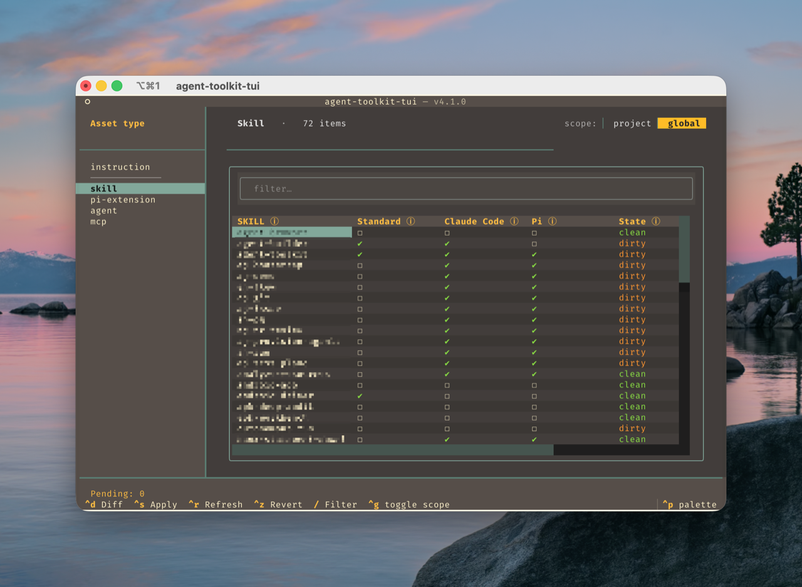

# Agent Toolkit CLI


---

> Keep AI-agent skills, subagents, instructions, Pi extensions, and MCP servers in sync across coding harnesses.



---

Agent Toolkit CLI prevents agent asset drift when you switch between coding harnesses. [Claude Code](docs/harnesses/claude-code.md), [Codex](docs/harnesses/codex.md), [OpenCode](docs/harnesses/opencode.md), [Gemini CLI](docs/harnesses/gemini-cli.md), [Pi](docs/harnesses/pi.md), [Cursor](docs/harnesses/cursor.md), and other tools all expect different files, folders, and config shapes for the same underlying assets.

It exists for two jobs:

1. Make it easy to see which [skills](docs/asset-types/skills.md), [agents](docs/asset-types/agents.md), [instructions](docs/asset-types/instructions.md), [Pi extensions](docs/asset-types/pi-extensions.md), and [MCP servers](docs/asset-types/mcp.md) each harness can use.
2. Keep one git-versioned source of truth for first-party and third-party assets.

[`agent-toolkit-cli`](docs/agent-toolkit/cli.md) keeps one canonical library copy per asset, records it in a lock file, then projects it into each harness by the simplest safe mechanism that harness supports: symlink, translated file, or config injection. `add`/`remove` manage library membership; `install`/`uninstall` manage harness visibility.

[`agent-toolkit-tui`](docs/agent-toolkit/tui.md) is the visual frontend: it makes cross-harness coverage visible and lets you manage assets at a glance.

Still a work in progress. I use it day-to-day and fix bugs as I find them. Please [open an issue](https://github.com/ajanderson1/agent-toolkit-cli/issues) if you hit one.

## Install

```bash
uv tool install --from git+https://github.com/ajanderson1/agent-toolkit-cli agent-toolkit
# SSH form: git+ssh://git@github.com/ajanderson1/agent-toolkit-cli
```

## Quickstart

```bash
# Add a skill to the library, then make it visible to Claude Code.
agent-toolkit-cli skill add anthropics/skills --skill pdf
agent-toolkit-cli skill install pdf --agents claude-code

# Add a subagent, then project it into all covered harnesses.
agent-toolkit-cli agent add ajanderson1/agents-workflow/release-manager
agent-toolkit-cli agent install release-manager -g

# Point supported harnesses at one canonical AGENTS.md.
agent-toolkit-cli instructions install --scope project

# Register an MCP server once, then inject it into selected harness configs.
agent-toolkit-cli mcp add --npx @upstash/context7-mcp --slug context7
agent-toolkit-cli mcp install context7 -g --harness claude-code --harness codex
```

## Mechanism basics

- **Library:** source-backed canonical assets live under the toolkit library, keyed by slug.
- **Lock files:** per-scope lock files record source, ref, current SHA, scope, and projection metadata.
- **Projection:** install commands make library assets visible to harnesses without duplicating ownership.
- **Adapters:** each harness gets the simplest safe adapter it supports:
  - **symlink** — point harness folder at canonical asset;
  - **translate** — generate harness-native shape from canonical markdown;
  - **config injection** — edit native JSON/TOML config by name, leaving unmanaged neighbours untouched.
- **Scopes:** global installs affect user-level harness homes; project installs affect current repo.

Full reference: [`docs/agent-toolkit/cli.md`](docs/agent-toolkit/cli.md). Compatibility matrix: [`docs/matrix.md`](docs/matrix.md).

## Commands

Two verb axes run through source-backed asset types: **`add`/`remove`** manage library membership (destructive — `remove` forgets the source), while **`install`/`uninstall`** manage projection into a harness/scope (non-destructive — the library copy survives). The [verb model](https://ajanderson1.github.io/agent-toolkit-cli/glossary/#verb-model) in the glossary is the single source of truth for semantics.

### Skills — lock-file driven, agent-aware

```text
agent-toolkit-cli skill add <source> [--ref <ref>] [--slug <slug>] [--skill <name>]
agent-toolkit-cli skill install <slug> [--agents <name>[,<name>...]] [--scope global|project]
agent-toolkit-cli skill uninstall <slug> [--agents <name>[,<name>...]] [--scope global|project]
agent-toolkit-cli skill list [-g|-p]
agent-toolkit-cli skill status [<slug>...] [-g|-p]
agent-toolkit-cli skill update [<slug>...] [-g|-p]
agent-toolkit-cli skill push [<slug>...] [-g|-p] [--direct]
agent-toolkit-cli skill import <file> [--latest]
agent-toolkit-cli skill remove <slug>... [--force]
```

`<source>` accepts `owner/repo`, full URL, SSH URL, local path, or skills.sh URL. Monorepo skills are supported with `--skill <name>` or a subpath source such as `owner/repo/<subpath>`. See [`docs/agent-toolkit/skill-lock.md`](docs/agent-toolkit/skill-lock.md) for lock-file format and skills.sh interop details.

`skill update` fetches and merges upstream into the canonical clone. `skill push` opens a PR branch by default for local skill improvements; `--direct` pushes straight to the tracked ref.

### Agents — subagent definitions across harnesses

```text
agent-toolkit-cli agent add <source> [--slug <slug>] [--ref <ref>]
agent-toolkit-cli agent install <slug> [-g|-p] [--harnesses <name>[,<name>...]]
agent-toolkit-cli agent uninstall <slug> [-g|-p] [--harnesses <name>[,<name>...]]
agent-toolkit-cli agent list [-g|-p] [--json]
agent-toolkit-cli agent status [<slug>...] [-g|-p]
agent-toolkit-cli agent update [<slug>...] [-g|-p]
agent-toolkit-cli agent push [<slug>...] [-g|-p] [--direct]
agent-toolkit-cli agent import <file> [--latest]
agent-toolkit-cli agent doctor [-g|-p]
agent-toolkit-cli agent remove <slug> [--force]
```

Agent assets are canonical markdown subagent definitions. Installs use the shared `standard` slot where harnesses read the same file natively, and fall back to per-harness adapters only where needed.

### Instructions — one canonical `AGENTS.md`

```text
agent-toolkit-cli instructions install   [--scope project|global] [--harness <name>]...
agent-toolkit-cli instructions uninstall [--scope project|global]
agent-toolkit-cli instructions list      [--format table|json]
agent-toolkit-cli instructions status    [--scope project|global]
agent-toolkit-cli instructions doctor    [--scope project|global]
```

Most harnesses read `AGENTS.md` natively. Harnesses that expect their own filename get a pointer symlink to the canonical file. Installs never clobber real files or foreign symlinks. Per-harness verdicts live in [`docs/agent-toolkit/harness-matrix.md`](docs/agent-toolkit/harness-matrix.md).

### Pi extensions — Pi-only extension assets

```text
agent-toolkit-cli pi-extension add <source> [--slug <slug>]
agent-toolkit-cli pi-extension install <slug> [-g|-p]
agent-toolkit-cli pi-extension uninstall <slug> [-g|-p]
agent-toolkit-cli pi-extension list [-g|-p] [--json]
agent-toolkit-cli pi-extension status [<slug>...] [-g|-p]
agent-toolkit-cli pi-extension update [<slug>...] [-g|-p]
agent-toolkit-cli pi-extension push [<slug>...] [-g|-p] [--direct]
agent-toolkit-cli pi-extension import <file> [--latest]
agent-toolkit-cli pi-extension doctor [-g|-p]
agent-toolkit-cli pi-extension remove <slug> [--force]
```

Pi extension commands manage source-backed extension repos plus Pi projection state. Inventory also reports loose local extensions and npm packages from Pi settings so unmanaged assets stay visible.

### MCP servers — library-driven config injection

```text
agent-toolkit-cli mcp add --npx|--uvx|--docker|--url|--local <source> [--slug <slug>]
agent-toolkit-cli mcp install <slug>   [--harness <name>]... [-g|-p] [--force]
agent-toolkit-cli mcp uninstall <slug> [--harness <name>]... [-g|-p] [--force]
agent-toolkit-cli mcp remove <slug>    [-g|-p] [--force]
agent-toolkit-cli mcp update <slug>
agent-toolkit-cli mcp list   [-g|-p]
agent-toolkit-cli mcp status [<slug>...] [-g|-p]
agent-toolkit-cli mcp doctor [-g|-p]
```

`mcp add` authors a library entry from a package, image, URL, or local path. `mcp install` projects it into Claude Code, Codex, OpenCode, Pi, or the `standard` target by editing native config by server name. Writes are atomic; doctor is diagnostic.

### Bundles — install several assets together

```text
agent-toolkit-cli bundle install  <manifest.json> [--global | --project]
agent-toolkit-cli bundle validate <manifest.json>
```

A bundle manifest declares a set of skills, agents, and Pi extensions. Install is all-or-nothing: each member is added and installed, and failures roll the whole bundle back. See [`docs/agent-toolkit/bundles.md`](docs/agent-toolkit/bundles.md).

### TUI

```text
agent-toolkit-tui
```

Interactive Textual cockpit over the same library and lock files. See [`docs/agent-toolkit/tui.md`](docs/agent-toolkit/tui.md).

## Development

```bash
git clone https://github.com/ajanderson1/agent-toolkit-cli ~/GitHub/projects/agent-toolkit-cli
cd ~/GitHub/projects/agent-toolkit-cli
uv sync --all-extras
uv run pytest -q
```

`lefthook.yml` runs pytest on pre-commit.

## License

MIT License with Commons Clause. You may use, copy, modify, fork, and distribute this project, but you may not sell it or sell products/services whose value derives substantially from it. See [`LICENSE`](LICENSE).
